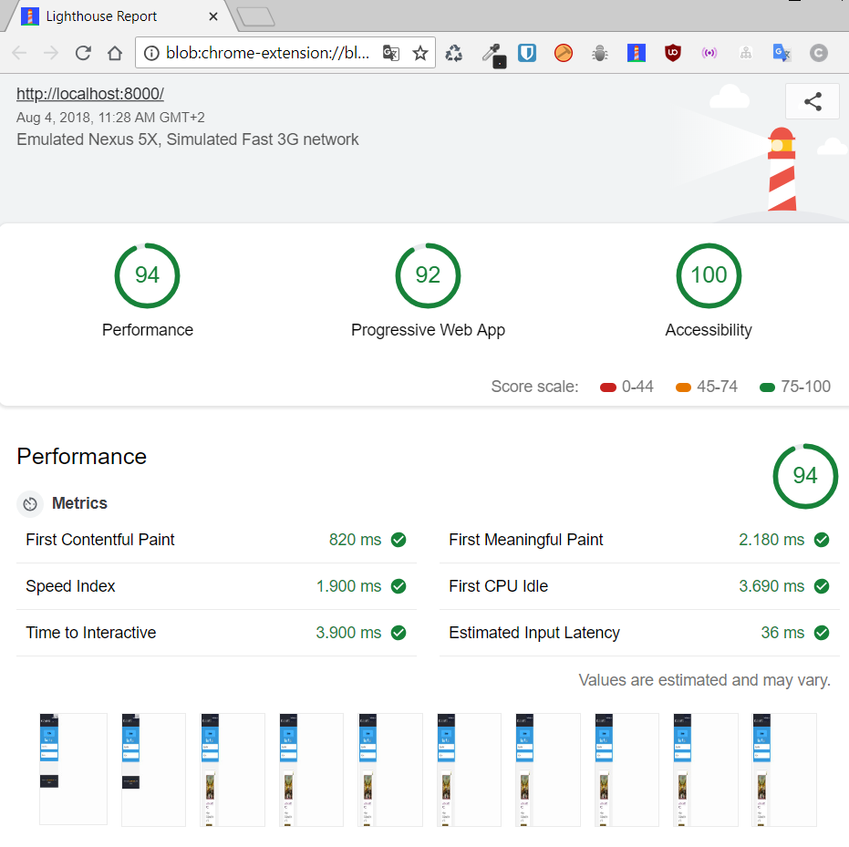
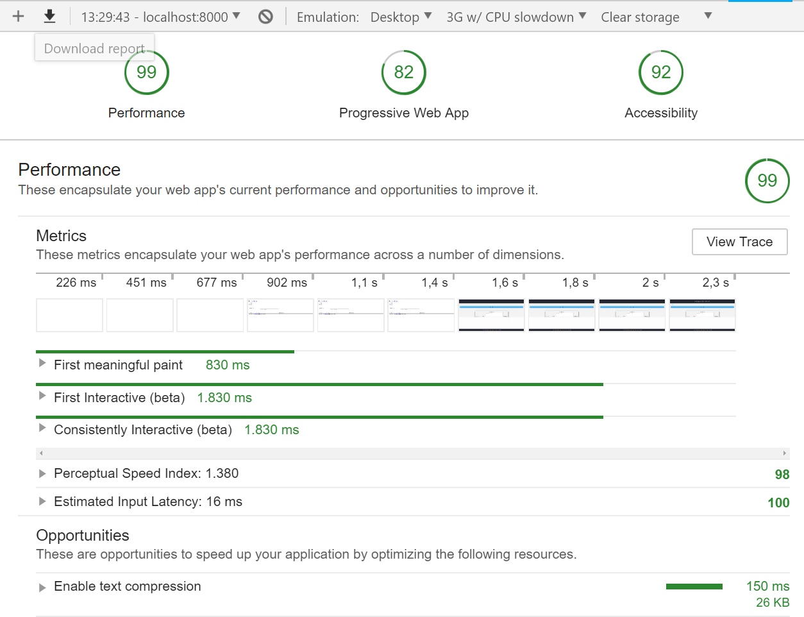

# Restaurant-mws-App

# Mobile Web Specialist Certification Course
---
## 3 Stage MWS

Now, in this stage we are using the fetch data from server api, in this stage I must be to use Service Worker and IndexedDB to cache data and optimize the project to satisfy the requirement when running lighthouse in chrome

- Progressive Web App: > 90.
- Performance: > 90.
- Accessibility: > 90.


For run the project is mandatory follow the next instructions.

## Instructions run server API
For run this app, you will download the server api from [here](https://github.com/udacity/mws-restaurant-stage-3).
way to the path to run the commands to below:

###### Install project dependancies
```
# npm i
```

###### Start the server
```
# node server
```

### Usage

#### Get Restaurants
```
curl "http://localhost:1337/restaurants"
```
#### Get Restaurants by id
````
curl "http://localhost:1337/restaurants/{3}"
````

## Instructions run APP

###### Note for **MAC OS**, users: If you are using Mac OS then before installing the dependancy, included in this project  "gulp-responsive" you should install the [libvips](https://github.com/jcupitt/libvips) library.  Further information and instructions can be found in the [sharp installation guide](http://sharp.dimens.io/en/stable/install/).

###### Install project dependancies
```
# npm i
```

##### Star the project APP

###### for minify-files and create the responsive images
```
# gulp minify-files 
```
###### for run the project
```
# gulp serve:dist 
```
###### for run the project on Dev
```
# gulp serve 
```

## Automaticaly open your default browser on localhost:8000, where you can view and navigate for the restaurant App.


### Lighthouse Results

*  HomePage



*  Details page




> In this stage, I decide use the leflet instead gmaps. I just decide this change for obtein better performance in audits tools as lighthouse in chrome developers.